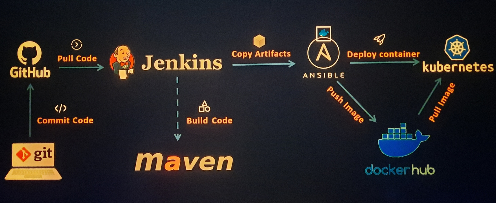

# CI/CD-pipeline project

<h1>This project was made to demonstrate **Kubernetes** skills and acquired knowledge in **CI/CD-pipeline** implementation</h1>

"DevOps Project - CI/CD with Jenkins Ansible Docker Kubernetes "

This Repository is a collection of Implementation documents.

### Purpose:

The following technologies and services were used in this project:

- Kubernetes
- Jenkins
- Maven
- Ansible
- Docker &
